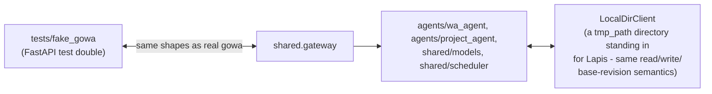

# Architecture — Watcher v1

One Python application (ADR-0005), one container, deployed with gowa
via Docker Compose (plus Grafana and Phoenix for observability,
ADR-0013). Packages under `shared/` are cross-cutting; the two
in-scope agents (`agents/wa_agent`, `agents/project_agent`) build on top
of them. See [[Spec - Watcher v1]] for the design behind each box and
`AGENTS.md` for the import rules the diagram below encodes.

## Runtime data flow

```mermaid
flowchart TB
    WA["WhatsApp<br/>(via gowa)"] -->|webhook, HMAC signed| GW

    subgraph Container["one container (ADR-0005)"]
        GW["shared/gateway<br/>webhook intake, message buffer,<br/>send, commands, Member Registry"]
        DB[("SQLite<br/>messages_buffer, channels, proposals,<br/>members_registry, jobs/runs, model_calls")]
        SCHED["shared/scheduler<br/>job registry, run ledger,<br/>per-key locks, retries"]
        WAAGENT["agents/wa_agent<br/>batch cutter, structured thread<br/>assignment + revision, lifecycle,<br/>Chat Agent, Proposals"]
        PAAGENT["agents/project_agent<br/>Item upsert, Status rewrite"]
        MODELS["shared/models<br/>Decision (Jev) / Worker / Mentor,<br/>structured output, skills, benchmark"]
        WIKI["shared/wiki<br/>schema, parser, page editor,<br/>Thread Store, lint, templates"]
        INBOX["shared/inbox<br/>inbox/&lt;agent&gt;.md:<br/>post, pending, ack, wake"]
        CMS["shared/cms<br/>member lookup"]
        HTTP["shared/http_adapter<br/>/api/* JSON pass-through"]
        OBS["shared/observability<br/>cost/latency attribution,<br/>wiki audit, OTel traces"]

        GW --> DB
        GW -->|message + reaction hooks| WAAGENT
        SCHED -->|triggers batches,<br/>staleness, Sunday nudge| WAAGENT
        SCHED -->|triggers Inbox<br/>consumption| PAAGENT
        WAAGENT --> MODELS
        WAAGENT --> WIKI
        WAAGENT -->|pending_messages,<br/>mark_consumed| GW
        WAAGENT -->|Update Notice| INBOX
        PAAGENT -->|pending, ack| INBOX
        INBOX --> WIKI
        INBOX -.->|triggering item:<br/>request_run| SCHED
        PAAGENT --> WIKI
        WAAGENT -->|Proposal confirm,<br/>link_member| GW
        WAAGENT --> CMS
        HTTP --> GW
        HTTP --> WIKI
        HTTP --> SCHED
        WAAGENT -.->|phase/channel scope| OBS
        SCHED -.->|job scope| OBS
        MODELS -.->|tokens, cost, latency| OBS
        WIKI -.->|every write/delete| OBS
        OBS --> DB
    end

    GW -->|send, react| WA
    WIKI <-->|read-modify-write,<br/>base revision| LAPIS[("Lapis vault<br/>(the wiki)")]
    MODELS -->|Choice/Noul/Score<br/>(Chat Agent only, ADR-0012)| JEV["Jev<br/>(Decision Model)"]
    MODELS -->|generate,<br/>generate_structured| OR["OpenRouter or any<br/>OpenAI-compatible endpoint<br/>(Worker/Mentor)"]
    CMS -->|get_member| ARIESCMS["ARIES CMS<br/>(protected read endpoints)"]
    OBS -->|OTLP spans| PHOENIX["Phoenix<br/>(LLM traces, SQLite)"]
    DB -->|SELECT via<br/>sqlite datasource| GRAFANA["Grafana<br/>(cost + ingestion dashboard)"]
```

The WhatsApp Agent reads messages only through the Gateway's
`pending_messages` / `mark_consumed` (the buffer table is the Gateway's),
writes Threads only through the Thread Store, and changes any page only
through the page editor, which enforces Section Owners and Fences. An
agent's Inbox is its page `inbox/<agent>.md`, reached only through
`shared/inbox` (ADR-0014).

Observability is a leaf: `shared/observability` depends on `shared.db`,
`shared.config` and `shared.wiki` (the client protocol it wraps) and on
nothing above them. In particular it never imports `shared.gateway` -
the scheduler imports observability and the gateway imports the
scheduler, so that would close a cycle. The ingest report is *rendered*
there and *sent* by `main.py` (ADR-0013).

## Module boundaries (enforced by convention, not tooling)

- Every package exposes exactly one `interface.py`; nothing outside a
  package imports a submodule directly (`shared.gateway.gowa_client`,
  `shared.wiki.parser`, etc. are never imported from outside their own
  package) - see `AGENTS.md`.
- `agents/wa_agent` and `agents/project_agent` never import each other;
  both go through `shared/*` interfaces for everything (identity,
  wiki I/O, models, scheduling).
- `agents/innovation-agent` and `agents/research-agent` are frozen
  (ADR-0010) and have zero import relationship with anything above -
  they predate this architecture entirely.

## Test seam (Testing Decisions, Seam 1)



Whole-pipeline tests replay a webhook through the real `receive_webhook`
-> `run_batch` -> wiki-write path against `fake_gowa` + `LocalDirClient`,
asserting on the resulting files and DB rows - never on prompts or
internal function calls (Testing Decisions).

## What's config, not code

Everything tunable lives in `shared/config.py` / `.env` - batch
size/timing, stale/silent thresholds, model names and endpoints, CMS/
Lapis/gowa URLs, the bot's mention name, proposal expiry. Changing
behaviour rarely means touching a package's logic.
